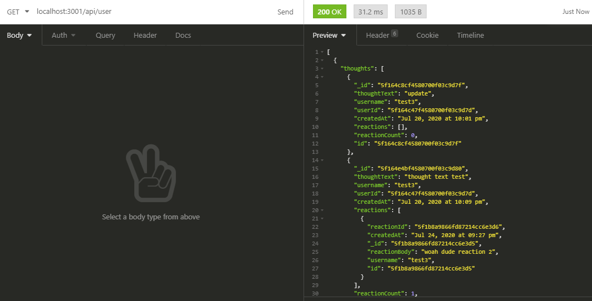
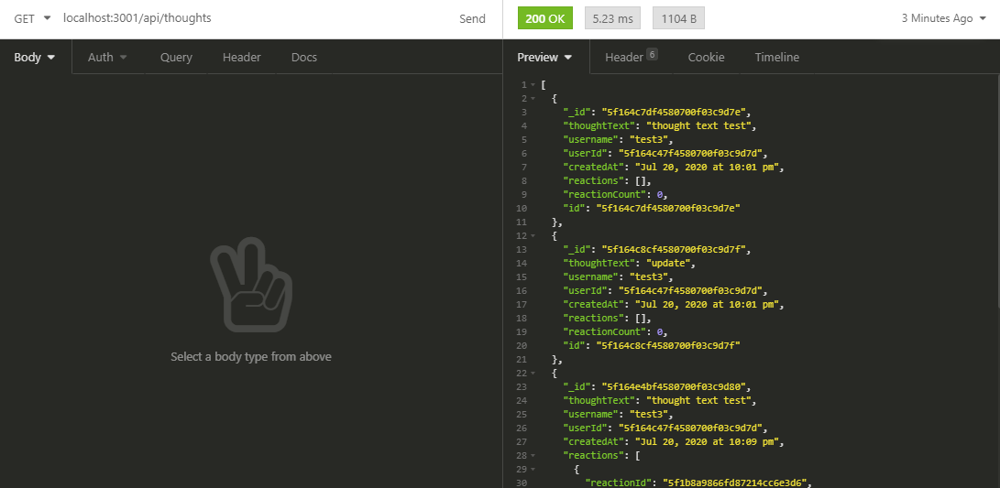
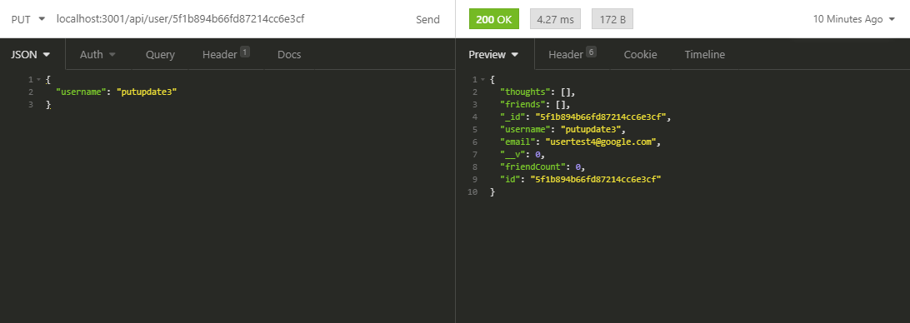
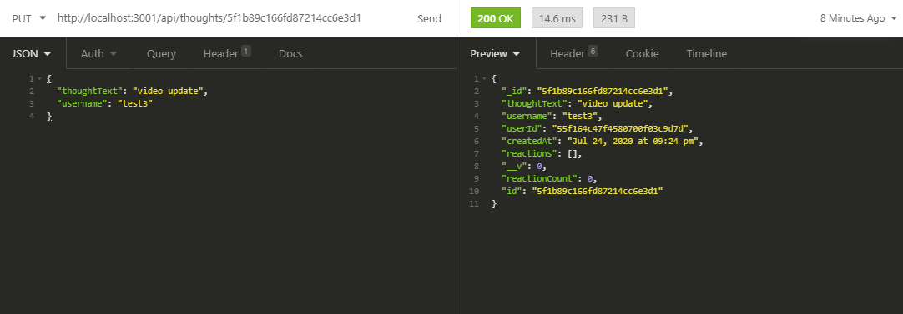

<h1 align="center">Social Network</h1>

  

## Table of Contents
- [Description](#description)
- [Installation](#install)
- [Usage](#usage)
- [Questions](#questions)

## Description
### Using Express Moment and MongoDB this application creates relationships between user, thought, and reaction objects allowing users to share thoughts and react to the thoughts of other users. 

### Screenshot of Insomnia calling all users and all thoughts with a get route.

### Screenshot of the program Insomnia, used to update thoughts and users.

## Usage
## Youtube Video running through all the routes in my social network. 

## Install
git init --> git clone

npm init  --> npm install 

npm install nodemon "if you want an easier time testing while changing routes"

## Questions
## Contact me at:
### [JCSRyan](https://github.com/jcsryan)
### JohnConnorSRyan@gmail.com